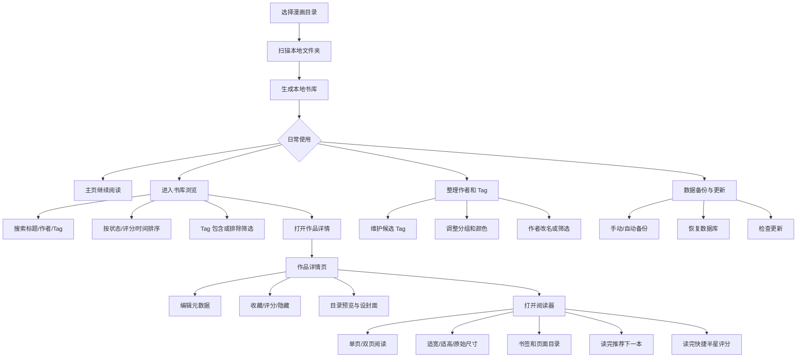
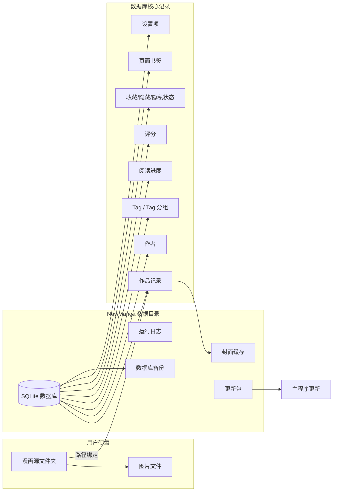
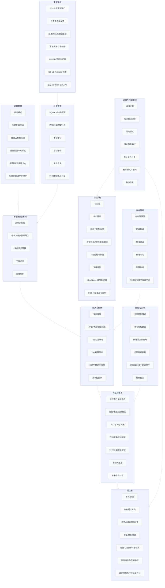

# NewManga 项目功能全景介绍

> 面向对象：项目介绍、用户说明、作品展示、后续 README/Release 文案整理。  
> 当前整理版本：`0.7.9.7`  
> 产品定位：离线优先的 Windows 本地漫画资料库与阅读器。

NewManga 是一款面向本地收藏用户的漫画资料库管理软件。它不依赖在线漫画源，不抓取远程元数据，也不做云同步；核心目标是把用户硬盘中的漫画文件夹整理成一个可检索、可筛选、可维护、可长期使用的个人漫画库，并提供稳定、低干扰、高画质的阅读体验。

项目的重点不是“下载漫画”，而是解决本地收藏长期管理中的问题：作品太多、目录散乱、作者和 Tag 难维护、阅读进度难保存、封面和隐私状态难管理、迁移和更新缺乏安全感。

## 项目全景图

```mermaid
flowchart LR
    Root((NewManga))

    Root --> Library[本地漫画资料库]
    Root --> Shelf[书库浏览]
    Root --> Tags[Tag 系统]
    Root --> Authors[作者系统]
    Root --> Detail[作品详情页]
    Root --> Reader[阅读器]
    Root --> Data[数据安全]
    Root --> Privacy[隐私功能]
    Root --> Update[更新系统]
    Root --> Settings[设置]

    Library --> Library1[文件夹扫描]
    Library --> Library2[作者文件夹导入]
    Library --> Library3[作品元数据]
    Library --> Library4[路径重新定位]
    Library --> Library5[删除库记录]

    Shelf --> Shelf1[搜索]
    Shelf --> Shelf2[筛选]
    Shelf --> Shelf3[排序]
    Shelf --> Shelf4[分页]
    Shelf --> Shelf5[多选管理]
    Shelf --> Shelf6[空结果状态]

    Tags --> Tags1[Tag 池]
    Tags --> Tags2[分组颜色]
    Tags --> Tags3[互斥规则]
    Tags --> Tags4[包含筛选]
    Tags --> Tags5[排除筛选]
    Tags --> Tags6[拖拽分配]

    Authors --> Authors1[作者管理]
    Authors --> Authors2[作者筛选]
    Authors --> Authors3[作者改名]
    Authors --> Authors4[作者删除]

    Detail --> Detail1[封面]
    Detail --> Detail2[简介]
    Detail --> Detail3[评分]
    Detail --> Detail4[收藏]
    Detail --> Detail5[编辑信息]
    Detail --> Detail6[目录预览]

    Reader --> Reader1[单页双页]
    Reader --> Reader2[适宽适高原始]
    Reader --> Reader3[质量性能模式]
    Reader --> Reader4[页面目录]
    Reader --> Reader5[页面书签]
    Reader --> Reader6[读完评分]

    Data --> Data1[SQLite]
    Data --> Data2[数据目录]
    Data --> Data3[自动备份]
    Data --> Data4[手动备份]
    Data --> Data5[恢复数据库]
    Data --> Data6[日志]

    Privacy --> Privacy1[全局隐私模式]
    Privacy --> Privacy2[单书隐私封面]
    Privacy --> Privacy3[删除源文件密码]

    Update --> Update1[本地包扫描]
    Update --> Update2[GitHub Release]
    Update --> Update3[更新窗口]
    Update --> Update4[独立 Updater]

    Settings --> Settings1[阅读偏好]
    Settings --> Settings2[快捷键]
    Settings --> Settings3[Tag 交互]
    Settings --> Settings4[危险操作]

    classDef root fill:#111827,color:#FFFFFF,stroke:#111827,stroke-width:1px;
    classDef module fill:#EEF2FF,color:#1F2937,stroke:#A5B4FC,stroke-width:1px;
    classDef item fill:#F9FAFB,color:#374151,stroke:#D1D5DB,stroke-width:1px;
    class Root root;
    class Library,Shelf,Tags,Authors,Detail,Reader,Data,Privacy,Update,Settings module;
    class Library1,Library2,Library3,Library4,Library5,Shelf1,Shelf2,Shelf3,Shelf4,Shelf5,Shelf6,Tags1,Tags2,Tags3,Tags4,Tags5,Tags6,Authors1,Authors2,Authors3,Authors4,Detail1,Detail2,Detail3,Detail4,Detail5,Detail6,Reader1,Reader2,Reader3,Reader4,Reader5,Reader6,Data1,Data2,Data3,Data4,Data5,Data6,Privacy1,Privacy2,Privacy3,Update1,Update2,Update3,Update4,Settings1,Settings2,Settings3,Settings4 item;
    linkStyle default stroke:#CBD5E1,stroke-width:1px;
```



## 用户流程图



## 数据结构图



## 详细功能 flowchart



## 项目特色

### 1. 离线优先，不绑定平台

NewManga 的所有核心数据都保存在本地。用户的漫画源文件、数据库、封面缓存、日志和备份都可以在本机管理，不依赖远程服务。

这种设计适合长期收藏场景：即使网络不可用，用户仍然可以浏览、筛选、阅读和维护自己的漫画库。

### 2. 以资料库为中心，而不是单纯看图

传统本地漫画阅读器往往只解决“打开文件夹看图片”。NewManga 更强调资料库维护：

- 每本漫画都有独立记录。
- 作者、Tag、评分、简介、阅读状态可以长期保存。
- 书库可以按筛选、排序、Tag 和作者进行重组。
- 文件夹移动后可以重新定位，不必丢失元数据。

### 3. Tag 是一等功能

Tag 系统不是简单的字符串列表，而是带分组、颜色、互斥、候选池、右键菜单、拖拽分配和筛选状态的完整管理系统。

用户可以用 Tag 表达内容形态、色彩规格、画质规格、题材、收藏偏好或任何自定义分类。

### 4. 阅读器兼顾画质和速度

阅读器提供质量模式和性能模式。质量模式更适合仔细观看图片细节，性能模式适合快速翻阅或低配置设备。

阅读器还支持：

- 单页/双页
- 左右阅读方向
- 适宽/适高/原始尺寸
- 背景切换
- 全屏
- 隐藏 UI
- 页面目录
- 页面书签
- 读完推荐
- 读完快捷评分

### 5. 数据安全优先

项目对危险操作保持保守：

- 删除库记录默认不删除源文件。
- 删除源文件需要额外密码。
- 数据库有备份和恢复入口。
- 更新器跳过用户数据目录。
- 迁移和恢复操作尽量保留日志。

这使它更适合管理大型个人收藏，而不是只面向临时阅读。

## 主要使用流程

### 初次使用

```text
选择漫画目录
  ↓
扫描本地漫画文件夹
  ↓
生成书库
  ↓
补充作者、Tag、封面、简介
  ↓
开始筛选和阅读
```

### 日常使用

```text
打开主页
  ├─ 继续阅读上次作品
  ├─ 查看最近阅读
  └─ 进入书库筛选新作品

进入书库
  ├─ 搜索标题/作者/Tag
  ├─ 按作者或状态筛选
  ├─ 用 Tag 包含/排除筛选
  ├─ 排序浏览
  └─ 打开作品详情

打开阅读器
  ├─ 阅读图片
  ├─ 自动保存进度
  ├─ 设定封面或书签
  └─ 读完后评分/跳转下一本
```

### 整理收藏

```text
进入标签页
  ├─ 新建候选 Tag
  ├─ 调整分组和颜色
  ├─ 设置互斥规则
  └─ 查看关联作品

进入作者页
  ├─ 新增作者
  ├─ 修正作者名
  ├─ 按作者筛选
  └─ 删除无用作者记录

进入批量管理
  ├─ 批量加 Tag
  ├─ 批量删 Tag
  ├─ 批量改卡片样式
  └─ 批量整理标题前缀
```

## 界面模块说明

### 主页

主页负责展示高频入口。用户可以从这里继续阅读、查看最近阅读作品，或者跳转到完整书库。

### 书库

书库是核心工作区。它展示完整漫画集合，并提供搜索、筛选、排序、分页、批量管理和 Tag 池。

当前书库前端经过多轮压缩和对齐优化，筛选区域保持紧凑，主列表获得更大的垂直空间。

### 标签页

标签页用于维护候选 Tag 和分组。它负责创建、编辑、删除、筛选 Tag，并维护 Tag 的颜色和互斥规则。

### 作者页

作者页用于集中管理作者名称。它可以创建独立作者，也可以对已关联作品的作者进行改名和筛选。

### 详情页

详情页是单本漫画的管理中心。用户可以阅读、收藏、评分、编辑元数据、查看目录、设置封面、隐藏作品、重新定位文件夹或删除库记录。

### 阅读器

阅读器是独立窗口，专注于低干扰阅读。它支持多种显示模式、翻页方式、快捷键、目录和书签，并在读完后提供下一本推荐和快捷评分。

### 设置

设置窗口集中处理通用偏好、阅读器行为、快捷键、数据目录、备份恢复、Tag 交互和危险操作。

### 更新窗口

检查更新使用独立窗口。点击检查后立即显示进度，不让用户误以为程序卡死；检查完成后在同一窗口显示有更新、无更新或失败状态。

## 数据结构概念

```text
漫画文件夹
  └─ 图片文件

软件数据库
  ├─ 作品记录
  ├─ 作者
  ├─ Tag
  ├─ 阅读进度
  ├─ 评分
  ├─ 收藏/隐藏/隐私状态
  ├─ 封面页
  ├─ 页面书签
  └─ 设置项

缓存与辅助文件
  ├─ 封面缓存
  ├─ 数据库备份
  ├─ 日志
  └─ 更新包
```

这种结构使源漫画文件和软件元数据分离。用户可以保留原始文件夹，同时让软件维护更丰富的资料库信息。

## 与普通文件夹管理的区别

| 普通文件夹 | NewManga |
|------------|----------|
| 只能按目录名查找 | 可按标题、作者、Tag、状态、评分筛选 |
| 阅读进度依赖记忆 | 自动保存阅读进度 |
| 封面通常不可维护 | 可设置封面页和隐私封面 |
| 作者和分类靠路径 | 作者与 Tag 可独立维护 |
| 难以批量整理 | 支持多选批量管理 |
| 移动目录容易丢上下文 | 可重新定位作品路径 |
| 无统一更新反馈 | 有独立更新窗口和本地包扫描 |

## 适合的用户

NewManga 适合以下用户：

- 有大量本地漫画收藏。
- 希望长期维护作者、Tag 和阅读记录。
- 不希望依赖在线平台或云服务。
- 希望阅读器同时兼顾画质和性能。
- 重视隐私封面、数据备份和本地可控性。
- 需要把漫画收藏整理成可筛选资料库，而不是只按文件夹堆放。

## 当前边界

当前项目明确不是以下类型的软件：

- 不是在线漫画源聚合器。
- 不负责下载漫画。
- 不抓取远程元数据。
- 不做云同步。
- 不以压缩包直读为核心能力。
- 不以移动端或网页端为当前主线。

这些边界让项目可以把精力集中在 Windows 本地资料库、阅读器体验和数据安全上。

## 一句话介绍

NewManga 是一款离线优先的 Windows 本地漫画资料库与阅读器，帮助用户把硬盘里的漫画收藏整理成可筛选、可维护、可备份、可持续阅读的个人漫画库。
